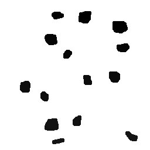

:toc: left
:stem:

= Atividades Processamento Digital de Imagens 

== Atividade 1 

     Para este primeiro exercício, foi implementado um programa regions.cpp, o qual irá solicitar dois pontos P1 e P2 localizados dentro dos limites da imagem fornecida. Estes pontos serão os vértices opostos de um retângulo, que terá região exibida como negativo.            

=== regions.cpp

Para fazer a implementação irei utilizar a imagem "biel.png":

image::biel.png[title="Biel"]

A saída do programa deve conter na região determinada, o negativo da imagem, como no exemplo a seguir:

image::negativo.png[title="Negativo da Imagem"]

[source,cpp]
----

#include <iostream>
#include <opencv2/opencv.hpp>

using namespace cv;
using namespace std;

int main(int, char**){
  Mat image;
  Vec3b val;

  image= imread("imagens/biel.png", IMREAD_COLOR); //IMREAD_GRAYSCALE
  
  if(!image.data)
    cout << "nao abriu biel.png" << endl;	
	
   int x1=1,y1=1, x2=1, y2=1;

   cout << "linhas: " << image.rows << endl;
   cout << "colunas: " << image.cols << endl;
   
   cout << "Digite a coordenada x do primeiro ponto:" << endl;
   cin >> x1;		
   while(x1 > image.rows || x1 < 1){
   	cout << "digite um valor de linha menor: " << endl;	
   	cin >> x1;
   }
   
   cout << "Digite a coordenada y do primeiro ponto:" << endl;
   cin >> y1;   
   while(y1 > image.cols || y1 < 1){
   	cout << "digite um valor de coluna menor: " << endl;	
   	cin >> y1;
   }
   
   cout << "Digite a coordenada x do segundo ponto:" << endl;
   cin >> x2;		
   while(x2 > image.rows || x2 < 1){
   	cout << "digite um valor de linha menor:" << endl;	
   	cin >> x2;
   }
   
   cout << "Digite a coordenada y do segundo ponto:" << endl;
   cin >> y2;
   while(y2 > image.cols || y2 < 1){
   	cout << "digite um valor de coluna menor: " << endl;	
   	cin >> y2;
   }
   
   //para ajustar ao tamanho da janela a imagem passada                      
   namedWindow("janela", WINDOW_AUTOSIZE);

   //algoritmo negativo	  
   for(int i=x1; i< x2; i++){
    for(int j=y1; j< y2*3; j++){
      image.at<uchar>(i,j)=255-image.at<uchar>(i,j);
    }
  }

  imwrite("/imagensnegativo.png", image);
  imshow("janela", image);
  waitKey();
  return 0;

}

----

== Atividade 2

     Utilizando o programa exemplos/pixels.cpp como referência, implemente um programa trocaregioes.cpp. Seu programa deverá trocar os quadrantes em diagonal na imagem. Explore o uso da classe Mat e seus construtores para criar as regiões que serão trocadas.

A saída do programa fica da seguinte maneira. 

image::trocaregioesOUT.png[title="Troca Regiões"]

[source,cpp]
----

#include <iostream>
#include <opencv2/opencv.hpp>

using namespace cv;
using namespace std;

int main(int, char **){
    Vec3b val; //nao foi utilizada nesse codigo

    Mat image;
    image = imread("imagens/biel.jpg", IMREAD_COLOR);
    if (!image.data){
        cout << "nao foi possivel abrir a imagem." << endl;
    }
    namedWindow("janela", WINDOW_AUTOSIZE);

    cout << "A imagem tem(altura, largura):" << endl;
    cout <<image.size().height << " " << image.size().width;

    //salvando o 1º quadrante em uma estrutura rect do tipo Rect
    //A ordem é: colunas, linhas
    Rect rect = Rect(0,0, image.cols/2, image.rows/2);
    //ou Rect rect(0,0, image.rows/2, image.cols/2);
   
    //fazendo cópia do 1º quadrante
    Mat temp_img = image(rect).clone();

    //fazendo cópia do 4º quadrante para o 1º
    image(Rect(image.cols/2,image.rows/2,image.cols/2,image.rows/2)).copyTo(image(rect));

    //fazendo cópia do 1º para o 4º
    temp_img.copyTo(image(Rect(image.cols/2,image.rows/2,image.cols/2,image.rows/2)));

    //salvando o 2º quadrante
    rect = Rect(image.cols/2,0, image.rows/2, image.cols/2);
    
    //fazendo cópia do 2º quadrante
    temp_img = image(rect).clone();
    
    //fazendo cópia do 3º quadrante para o 1º
    image(Rect(0,image.rows/2,image.cols/2,image.rows/2)).copyTo(image(rect));
    
    //fazendo cópia do 1º quadrnate para o 3º
    temp_img.copyTo(image(Rect(0,image.rows/2,image.cols/2,image.rows/2)));

    imshow("janela", image);
    waitKey();
    imwrite("imagens/trocaregioesOUT.png", image);

    return 0;
}

----

== Atividade 3 

Observando-se o programa labeling.cpp como exemplo, é possível verificar que caso existam mais de 255 objetos na cena, o processo de rotulação poderá ficar comprometido. Identifique a situação em que isso ocorre e proponha uma solução para este problema.

Aprimore o algoritmo de contagem apresentado para identificar regiões com ou sem buracos internos que existam na cena. Assuma que objetos com mais de um buraco podem existir. Inclua suporte no seu algoritmo para não contar bolhas que tocam as bordas da imagem. Não se pode presumir, a priori, que elas tenham buracos ou não.

Será utilizado a seguinte imagem bolhas.png 

image::bolhas.png[title="Bolhas"]

Imagem com as bordas removidas

image::bordasremovidas.png[title="Bordas removidas"]

Imagem da contagem das bolhas feitas, alterando o tom de cinza para visualização:

image::contagemdasbolhas.png[title="contagem alterando tons de cinza"]

Imagem das bolhas que não possuem bordas internas:

[source,cpp]
----
#include <iostream>
#include <opencv2/opencv.hpp>

using namespace cv;
using namespace std;

int main(int argc, char ** argv) {
    Mat image;
    int width, height, nobjects, bolhasinternas;

    Point p;
    image = imread(argv[1], IMREAD_GRAYSCALE);

    if ( ! image.data) {
        cout << "imagem nao carregou corretamente\n";
        return (-1);
    }
    width = image.size().width;
    height = image.size().height;

    p.x = 0;
    p.y = 0;

    //Varredura nas Bordas
    //Horizontal
    for (int i = 0; i < height; i = i + height - 1) {
        for (int j = 0; j < width; j++) {
            if (image.at<uchar>(i,j) == 255) {
                // achou um objeto
                p.x = j;
                p.y = i;
                floodFill(image, p, 0);
            }
        }
    }
    //Vertical
    for (int i = 0; i < height; i++) {
        for (int j = 0; j < width; j = j + width - 1) {
            if (image.at<uchar>(i,j) == 255) {
                // achou um objeto
                p.x = j;
                p.y = i;
                floodFill(image, p, 0);
            }
        }
    }

    imwrite("imagens/labeling-bordas.png", image);
    p.x=0;
    p.y=0;
    nobjects=0;
    for(int i=0; i<height; i++){
        for(int j=0; j<width; j++){
            if(image.at<uchar>(i,j) == 255){
                // achou um objeto
                nobjects++;
                p.x=j;
                p.y=i;
                floodFill(image,p,nobjects);
            }
        }
    }

    imwrite("imagens/labeling-final.png", image);
    bolhasinternas = 0;
    // busca objetos com buracos presentes
    p.x = 0;
    p.y = 0;
    floodFill(image, p, 255);

    for (int i = 1; i < height-1; i++) {
        for (int j = 1; j < width-1; j++) {
            if (image.at<uchar>(i-1, j) > 0 
                && image.at<uchar>(i-1,j) < 255 
                && image.at<uchar>(i,j) == 0)
            {
                // achou um objeto
                bolhasinternas++;
                p.x = j;
                p.y = i-1;
                floodFill(image, p, 255);
                p.x = j;
                p.y = i;
                floodFill(image, p, 255);
            }
        }
    }

    imshow("image", image);
    imwrite("imagens/labeling-com-bolhas.png", image);
    waitKey();
    cout << "\nForam encontradas " << nobjects << " bolhas no total sendo " << bolhasinternas << " com bolhas internas \n";
    return 0;
}

----

== Atividade 4

Utilizando o programa exemplos/histogram.cpp como referência, implemente um programa equalize.cpp. Este deverá, para cada imagem capturada, realizar a equalização do histogram antes de exibir a imagem. Teste sua implementação apontando a câmera para ambientes com iluminações variadas e observando o efeito gerado. Assuma que as imagens processadas serão em tons de cinza.

Utilizando o programa exemplos/histogram.cpp como referência, implemente um programa motiondetector.cpp. Este deverá continuamente calcular o histograma da imagem (apenas uma componente de cor é suficiente) e compará-lo com o último histograma calculado. Quando a diferença entre estes ultrapassar um limiar pré-estabelecido, ative um alarme. Utilize uma função de comparação que julgar conveniente.

Imagem normal, gerada apenas mostrando seu histograma

image::baixo1.png[title="Imagem com seu histograna"]

Imagem equalizada gerada com o algoritmo equalize.cpp:

image::baixo2.png[title="Imagem gerada apartir do algoritmo equalize.cpp"]

[source,cpp]

----
#include <iostream>
#include <opencv2/opencv.hpp>

using namespace cv;
using namespace std;

int main(int argc, char** argv){
  Mat image;
  int width, height;
  VideoCapture cap;
  vector<Mat> planes;
  Mat histR, histG, histB;
  int nbins = 64;
  float range[] = {0, 256};
  const float *histrange = { range };
  bool uniform = true;
  bool acummulate = false;

  cap.open(0);

  if(!cap.isOpened()){
    cout << "cameras indisponiveis";
    return -1;
  }

  width  = cap.get(CAP_PROP_FRAME_WIDTH);
  height = cap.get(CAP_PROP_FRAME_HEIGHT);

  cout << "largura = " << width << endl;
  cout << "altura  = " << height << endl;

  int histw = nbins, histh = nbins/2;
  Mat histImgR(histh, histw, CV_8UC3, Scalar(0,0,0));
  Mat histImgG(histh, histw, CV_8UC3, Scalar(0,0,0));
  Mat histImgB(histh, histw, CV_8UC3, Scalar(0,0,0));

  while(1){
    cap >> image;
    split (image, planes);

    equalizeHist(planes[0], planes[0]);
    equalizeHist(planes[1], planes[1]);
    equalizeHist(planes[2], planes[2]);    
     
    merge(planes, image); 

    calcHist(&planes[0], 1, 0, Mat(), histR, 1,
             &nbins, &histrange,
             uniform, acummulate);
    calcHist(&planes[1], 1, 0, Mat(), histG, 1,
             &nbins, &histrange,
             uniform, acummulate);
    calcHist(&planes[2], 1, 0, Mat(), histB, 1,
             &nbins, &histrange,
             uniform, acummulate);

    

    normalize(histR, histR, 0, histImgR.rows, NORM_MINMAX, -1, Mat());
    normalize(histG, histG, 0, histImgG.rows, NORM_MINMAX, -1, Mat());
    normalize(histB, histB, 0, histImgB.rows, NORM_MINMAX, -1, Mat());
    
    histImgR.setTo(Scalar(0));
    histImgG.setTo(Scalar(0));
    histImgB.setTo(Scalar(0));

    for(int i=0; i<nbins; i++){
      line(histImgR,
           Point(i, histh),
           Point(i, histh-cvRound(histR.at<float>(i))),
           Scalar(0, 0, 255), 1, 8, 0);
      line(histImgG,
           Point(i, histh),
           Point(i, histh-cvRound(histG.at<float>(i))),
           Scalar(0, 255, 0), 1, 8, 0);
      line(histImgB,
           Point(i, histh),
           Point(i, histh-cvRound(histB.at<float>(i))),
           Scalar(255, 0, 0), 1, 8, 0);
    }

    histImgR.copyTo(image(Rect(0, 0       ,nbins, histh)));
    histImgG.copyTo(image(Rect(0, histh   ,nbins, histh)));
    histImgB.copyTo(image(Rect(0, 2*histh ,nbins, histh)));
    imshow("image", image);
    if(waitKey(30) >= 0) break;
  }
  return 0;
}

----

== Atividade 5

Utilizando o programa exemplos/filtroespacial.cpp como referência, implemente um programa laplgauss.cpp. O programa deverá acrescentar mais uma funcionalidade ao exemplo fornecido, permitindo que seja calculado o laplaciano do gaussiano das imagens capturadas. Compare o resultado desse filtro com a simples aplicação do filtro laplaciano.

Imagem  utilizada para fazer as comparações

Imagem gerada a partir do algoritmo filtroespacial.cpp, utilizando o filtro laplaciano:

image::laplaciano.png[title="Imagem Gerada Apartir do Laplaciano"]

Imagem gerada a partir do algoritmo laplgauss.cpp, juntando os filtros laplaciano e gaussiano:

image::laplacianogaussiano.png[title="Imagem Gerada Apartir do Filtro Laplaciano e Gaussiano"]

[source,cpp]

----
#include <iostream>
#include <opencv2/opencv.hpp>

using namespace cv;
using namespace std;

void printmask(Mat &m){
  for(int i=0; i<m.size().height; i++){
    for(int j=0; j<m.size().width; j++){
      cout << m.at<float>(i,j) << ",";
    }
    cout << endl;
  }
}

void menu(){
  cout << "\npressione a tecla para ativar o filtro: \n"
  "a - calcular modulo\n"
  "m - media\n"
  "g - gauss\n"
  "v - vertical\n"
  "h - horizontal\n"
  "l - laplaciano\n"
  "n - laplaciano do gaussiano\n" 
  "esc - sair\n";
}

int main(int argvc, char** argv){
  VideoCapture video;
  float media[] = {1,1,1,
           1,1,1,
           1,1,1};
  float gauss[] = {1,2,1,
           2,4,2,
           1,2,1};
  float horizontal[]={-1,0,1,
            -2,0,2,
            -1,0,1};
  float vertical[]={-1,-2,-1,
          0,0,0,
          1,2,1};
  float laplacian[]={0,-1,0,
           -1,4,-1,
           0,-1,0};
  float laplacian_gauss[]={0,0,-1,0,0,
           0,-1,-2,-1,0,
           -1,-2,16,-2,-1,
           0,-1,-2,-1,0,
           0,0,-1,0,0};

  Mat cap, frame, frame32f, frameFiltered;
  Mat mask(3,3,CV_32F), mask1;
  Mat result, result1;
  double width, height, min, max;
  int absolut;
  char key;
  
  video.open(0); 
  if(!video.isOpened()) 
    return -1;
  width=video.get(CAP_PROP_FRAME_WIDTH);
  height=video.get(CAP_PROP_FRAME_HEIGHT);
  std::cout << "largura=" << width << "\n";;
  std::cout << "altura =" << height<< "\n";;

  namedWindow("filtroespacial",1);

  mask = Mat(3, 3, CV_32F, media); 
  scaleAdd(mask, 1/9.0, Mat::zeros(3,3,CV_32F), mask1);
  swap(mask, mask1);
  absolut=1; // calcula o valor absoluto da imagem

  menu();
  for(;;){
    video >> cap; 
    cvtColor(cap, frame, COLOR_BGR2GRAY);// antigo CV_BGR2GRAY
    flip(frame, frame, 1);
    imshow("original", frame);
    frame.convertTo(frame32f, CV_32F);
    filter2D(frame32f, frameFiltered, frame32f.depth(), mask, Point(1,1), 0);
    if(absolut){
      frameFiltered=abs(frameFiltered);
    }
    frameFiltered.convertTo(result, CV_8U); 
    
    imshow("filtroespacial", result);
    key = (char) waitKey(10);
    if( key == 27 ) break; // tecla esc pressionada
    switch(key){
    case 'a':
    menu();
      absolut=!absolut;
      break;
    case 'm':
    menu();
      mask = Mat(3, 3, CV_32F, media);
      scaleAdd(mask, 1/9.0, Mat::zeros(3,3,CV_32F), mask1);
      mask = mask1;
      printmask(mask);
      break;
    case 'g':
    menu();
      mask = Mat(3, 3, CV_32F, gauss);
      scaleAdd(mask, 1/16.0, Mat::zeros(3,3,CV_32F), mask1);
      mask = mask1;
      printmask(mask);
      break;
    case 'h':
    menu();
      mask = Mat(3, 3, CV_32F, horizontal);
      printmask(mask);
      break;
    case 'v':
    menu();
      mask = Mat(3, 3, CV_32F, vertical);
      printmask(mask);
      break;
    case 'l':
    menu();
      mask = Mat(3, 3, CV_32F, laplacian);
      printmask(mask);
      break;
    case 'z':
    menu();
      mask = Mat(5, 5, CV_32F, laplacian_gauss);
      printmask(mask);
      break;
    default:
      break;
    }
  }
  return 0;
}
----

